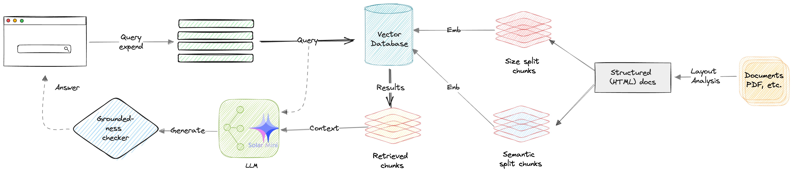

# Overview

The Solar framework by Upstage provides a comprehensive suite of exercises designed to equip users with the skills needed to effectively utilize large language models (LLMs) across a variety of applications. Starting with foundational concepts like setup and prompt engineering, the tutorials progress through advanced techniques such as managing hallucinations, implementing Credibility-Aware Generation (CAG), and conducting Retrieval-Augmented Generation (RAG) using various database systems like ChromaDB, MongoDB, and OracleDB. The exercises also explore innovative methods like Smart RAG and Tool-RAG to enhance retrieval accuracy and generation relevance. Additionally, Solar offers integration with Gradio to build user-friendly web interfaces for interactive applications, including real-time streaming and PDF-based RAG systems. Through these exercises, users gain a deep understanding of the Solar framework's capabilities, enabling them to create reliable, contextually accurate, and user-centric language model applications.

# Table of Contents

## Introduction and Fundamentals of Generative AI 

**1/ Hello Solar**

**Introduction to Solar Framework**: Learn the basics of setting up the Solar LLM framework and running a simple "Hello, World!" example to understand its core functionality.

**2/ Prompt Engineering**

**Crafting Effective Prompts**: Explore techniques for designing prompts that optimize the performance of the Solar LLM in various NLP tasks. 

**3/ Hallucinations**

**Understanding Model Hallucinations**: Discover how to identify, understand, and mitigate hallucinations to ensure accurate and reliable model outputs.

**4/ Credibility-Aware Generation (CAG) and Groundedness Check (GC)**

**Enhancing Output Reliability**: Implement CAG and GC techniques to generate credible, well-grounded responses from the language model.

----

## Developing an End-to-End RAG Solution 

### VetctorDB

**5-1/ ChromaDB**

**Creating Vectorspaces and Retrieval Objects**: Utilize ChromaDB to embed documents, create a vectorspace, and conduct efficient query searches.

**5-2/ MongoDB**

**Conducting Hybrid Searches**: Implement MongoDB for embedding, retrieval, and conducting advanced hybrid searches using Atlas Index.

**5-3/ OracleDB**

**Building an LLM Chain**: Learn how to use OracleDB for embedding and retrieval, and create an LLM Chain integrated with a Retriever object.

### Layout Analysis

**6/ PDF Credibility-Aware Generation (PDF CAG)**

**Processing PDF Documents**: Learn to apply CAG techniques to extract, evaluate, and generate credible content from PDF documents.

**7/ Language Analysis with Credibility-Aware Generation (LA CAG)**

**Combining Language Analysis and CAG**: Integrate language analysis with CAG to produce accurate and credible responses from diverse language inputs.

### RAG

**8/ Retrieval-Augmented Generation (RAG)**

**Leveraging External Knowledge**: Use RAG to combine retrieval-based techniques with generative models for more informed and contextually accurate responses.

**9/ Smart Retrieval-Augmented Generation (Smart RAG)**

**Advanced Retrieval Techniques**: Incorporate intelligent retrieval mechanisms to enhance RAG with more relevant and high-quality information.

**10/ Tool Retrieval-Augmented Generation (Tool RAG)**

**Integrating External Tools**: Use Tool-RAG to refine and augment information retrieval and generation with external tools.

----

## Applications and Integration

### Common Applications of LLM

**11/ Summary with Translation**
fi**Summarization and Translation using Solar API**: Leverage the Solar API for effective summarization and translation between English and Korean.

**12/ Chat with History**

**Managing Conversations with Context**: Develop a question-answering system that uses conversation history to generate contextually appropriate responses. 

### 80/ Gradio Integration**

**80/ Building Web Interfaces with Gradio**: Create simple and intuitive web applications using Gradio for interactive model deployment. 

**81/ Real-Time Response Streaming**: Implement a RAG system with Gradio to handle real-time interactions and response streaming. 

**82/ Comprehensive RAG System for PDFs**: Use Gradio and RAG techniques to process PDF documents and generate real-time, interactive responses.
