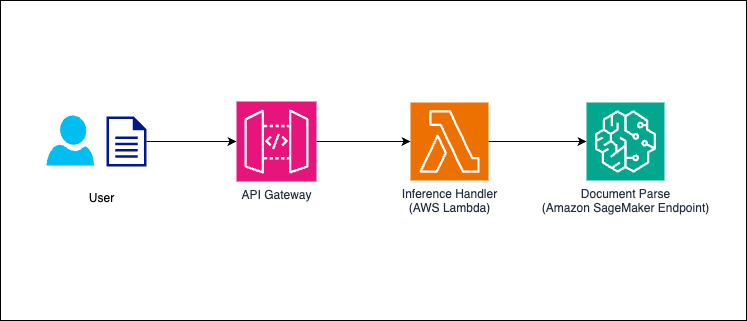

# Document Processing with Sagemaker, Lambda, API Gateway
This is an AWS CDK Stack that creates a flow from API Gateway -> Lambda -> SageMaker Endpoint.
Using API Gateway and Lambda, you can utilize the SageMaker Endpoint with the same interface as the Upstage Console.

## Architecture



- **SageMaker Endpoint**: inference service that hosts upstage document-parse model
- **API Gateway**: REST API interface that handles HTTP requests, manages authentication with API keys, and routes requests to Lambda
- **Lambda Function**: serverless compute service that processes incoming requests, handles file validation, and communicates with the SageMaker endpoint


## Prerequisites

- AWS CLI configured with appropriate credentials
- Node.js (>=14.x) and npm installed
- AWS CDK CLI installed (`npm install -g aws-cdk`)


## Setup

1. Clone the repository and install dependencies:
```bash
git clone https://github.com/UpstageAI/cookbook
cd cookbook/aws/use_cases/aws-cdk/cases/dp-api-gateway
npm ci
```

2. Configure environment variables:
```bash
cp .env.example .env
```


## Deploy
Deploy all stacks at once:
```bash
cdk deploy --all
```

Find the api url from the `SetupResourceStageApiGatewayStack25847E5D.ApiUrl` in the Output.

## Testing the application

### Model Inference

Make inference requests by referring to the [Document Parse API Reference](https://console.upstage.ai/api/document-parse).
```
curl -X POST \
-H "Content-Type: multipart/form-data" \
-H "x-api-key: [API_KEY_VALUE]" \
-F "document=@./sample.jpg" \
-F "model=document-parse" \
https://[API_GATEWAY_URL]/v1/document-ai/document-parse | jq
```


## Limitations
There are some limitations compared to the Upstage Console:

- **File Size Limit**: 
  - Upstage Console: 50MB
  - This CDK Stack: 6MB (Lambda payload limit)

- **Timeout**:
  - Upstage Console: 10 minutes
  - This CDK Stack: 29 seconds (API Gateway timeout limit)


## Useful commands
- `npm run build` compile typescript to js
- `npm run watch` watch for changes and compile
- `npm run test` perform the jest unit tests
- `cdk deploy` deploy this stack to your default AWS account/region
- `cdk diff` compare deployed stack with current state
- `cdk synth` emits the synthesized CloudFormation template