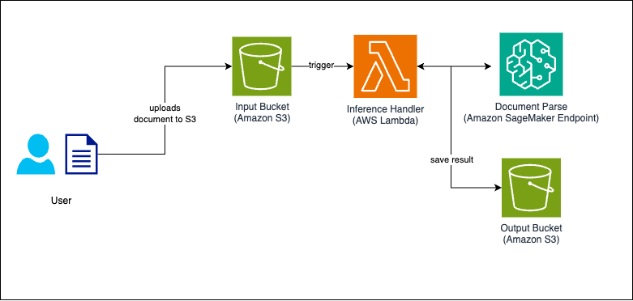

# Document Processing with SageMaker, S3, Lambda

A sample on how to configure and deploy application.

It is comprised of a few core pieces:

- **Amazon Sagemaker** as the service providing easy API based access to marketplace machine learning models.

- **Lambda + S3(Simple Storage Service)** as the serverless compute and storage solution, where Lambda functions handle the processing logic and S3 serves as the storage for input and output documents.

This project deploys an automated document processing system using AWS SageMaker and Lambda. It processes documents uploaded to an S3 bucket using the Upstage Document Parse model, triggering a Lambda function to send the document to SageMaker for inference and storing the extracted data back in S3.


## Architecture



- **SageMaker Endpoint**: inference service that hosts upstage document-parse model
- **S3 Input/Output Bucket**: Receives documents for processing & stores document parse processed results
- **Lambda Function**: Processes documents and manages the workflow

## Prerequisites

- AWS CLI configured with appropriate credentials
- Node.js (>=14.x) and npm installed
- AWS CDK CLI installed (`npm install -g aws-cdk`)


## Setup

1. Clone the repository and install dependencies:
```bash
git clone https://github.com/UpstageAI/cookbook
cd cookbook/aws/use_cases/aws-cdk/cases/dp-s3-connector
npm ci
```

2. Configure environment variables:
```bash
cp .env.example .env
```

## Deploy
Deploy all stacks at once:
```bash
cdk deploy --all
```

or deploy individual stacks:
```bash
cdk deploy dp-s3-connector--DP-Sagemaker
cdk deploy dp-s3-connector--S3-Inference-Automation
```

## Testing the application

## Upload Sample file to s3

```bash
aws s3 sync samples s3://dp-s3-connector-input-bucket
```

Supported image types are
- PDF (.pdf)
- Images (.png, .jpeg, .jpg)

When you execute the above command, the first file uploaded will be `sample1.png`.

```bash
aws s3 ls s3://dp-s3-connector-input-bucket
2025-04-03 01:18:44     196160 sample.png
```

After the Lambda function is triggered, the contents of the input bucket will be moved under the `processed/` folder.
```bash
aws s3 ls s3://dp-s3-connector-input-bucket --recursive
2025-04-03 01:18:44     196160 processed/sample.png
```

Once the file is uploaded, the Lambda function is triggered, and document parse sagemaker endpoint results are stored in the output folder.

```bash
aws s3 ls s3://dp-s3-connector-output-bucket
2025-04-03 01:21:44      85800 sample.json
```

## Useful commands
- `npm run build` compile typescript to js
- `npm run watch` watch for changes and compile
- `npm run test` perform the jest unit tests
- `cdk deploy` deploy this stack to your default AWS account/region
- `cdk diff` compare deployed stack with current state
- `cdk synth` emits the synthesized CloudFormation template