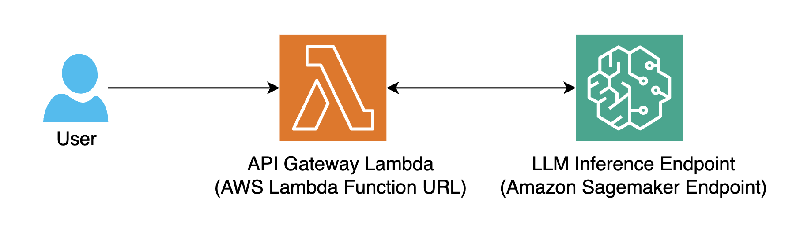

# Solar LLM with SageMaker and Lambda

A sample on how to configure and deploy a serverless LLM inference service using AWS SageMaker and Lambda.

It is comprised of a few core pieces:

- **Amazon SageMaker** as the service providing easy API based access to the Solar LLM model.
- **Lambda** as the serverless compute solution, handling the inference requests and streaming responses.
- **Function URL** for direct HTTP access to the Lambda function.

This project deploys a serverless LLM inference service using AWS SageMaker and Lambda. It provides a streaming API endpoint that accepts chat completion requests and returns responses in real-time.

## OpenAI Compatibility

This project implements Lambda as a compatibility layer to match OpenAI's Chat Completion API interface. This means you can use existing OpenAI client libraries by simply changing the base URL to your Lambda Function URL.

## Architecture



Components:
- **LLM Inference Endpoint**: Amazon SageMaker endpoint that hosts the Solar Pro model
- **API Gateway Lambda**: Lambda function with Function URL that handles API requests and responses

## Features
- Lambda function with streaming support
- Function URL for direct invocation
- SageMaker endpoint integration
- API key authentication
- OpenAI Chat Completion API compatible interface

## Limitations
- **SageMaker Endpoint Timeout**: 60 seconds per request (can be increased with custom containers)
- **SageMaker Endpoint Scaling**: Initial scaling depends on instance type and model size

## Prerequisites

- AWS CLI configured with appropriate credentials
- Node.js (>=14.x) and npm installed
- AWS CDK CLI installed (`npm install -g aws-cdk`)

## Setup

1. Clone the repository and install dependencies:
```bash
git clone https://github.com/UpstageAI/cookbook
cd cookbook/aws/use_cases/solar-sagemaker-lambda
npm ci
```

2. Configure environment variables:
```bash
cp .env.sample .env
```

Edit the `.env` file and set the required environment variables:
- `CDK_ACCOUNT_ID`: Your AWS account ID
- `CDK_DEFAULT_REGION`: AWS region code (e.g., ap-northeast-2, us-east-1)
- `API_KEY_VALUE`: API key for authentication (at least 20 characters)

## Deploy

Deploy the stack:
```bash
cdk deploy SetupResourceStage/SolarLambdaStack
```

The deployment process will:
1. Create a SageMaker endpoint for the Solar LLM model
2. Create a Lambda function with streaming support
3. Configure necessary IAM roles and permissions
4. Create a Function URL for direct invocation

You'll be prompted to confirm the changes twice:
1. First prompt: Confirm SageMaker stack deployment
   - IAM role for SageMaker with full access
   - Type `y` to confirm
2. Second prompt: Confirm Lambda stack deployment
   - IAM role for Lambda with basic execution and SageMaker invoke permissions
   - Function URL configuration for public access
   - Type `y` to confirm

After successful deployment, you'll see the following outputs:
- SageMaker endpoint name (e.g., `solar-pro-1743643334446`)
- Lambda function URL (e.g., `https://xxxxx.lambda-url.us-west-2.on.aws/`)

Save these values for making inference requests.

## Testing the application

Make an inference request using curl:

```bash
curl -X POST \
-H "Content-Type: application/json" \
-H "Authorization: Bearer [API_KEY_VALUE]" \
-d '{
  "model": "solar-pro",
  "messages": [
    {"role": "system", "content": "You are a helpful assistant."},
    {"role": "user", "content": "Hello, how are you?"}
  ]
}' \
https://[FUNCTION_URL]
```

The response will be streamed in real-time.

### Python Example

```python
from openai import OpenAI

client = OpenAI(
    api_key="your-api-key",  # API_KEY_VALUE from .env
    base_url="https://[FUNCTION_URL]"  # Your Lambda Function URL
)

response = client.chat.completions.create(
    model="solar-pro",
    messages=[
        {"role": "system", "content": "You are a helpful assistant."},
        {"role": "user", "content": "What is AWS Lambda?"}
    ],
    stream=True  # Supports streaming
)

for chunk in response:
    if chunk.choices[0].delta.content is not None:
        print(chunk.choices[0].delta.content, end="")
```

### API Compatibility Notes

- The API follows OpenAI's Chat Completion API specification
- Supported parameters:
  - `model`: Always use "solar-pro"
  - `messages`: Array of message objects with `role` and `content`
  - `stream`: Boolean for streaming responses (recommended)
  - `temperature`: Controls randomness (0.0 to 2.0)
  - `max_tokens`: Maximum number of tokens to generate
- Authentication uses the same header format: `Authorization: Bearer YOUR_API_KEY`

## Useful commands
- `npm run build` compile typescript to js
- `npm run watch` watch for changes and compile
- `npm run test` perform the jest unit tests
- `cdk deploy` deploy this stack to your default AWS account/region
- `cdk diff` compare deployed stack with current state
- `cdk synth` emits the synthesized CloudFormation template
