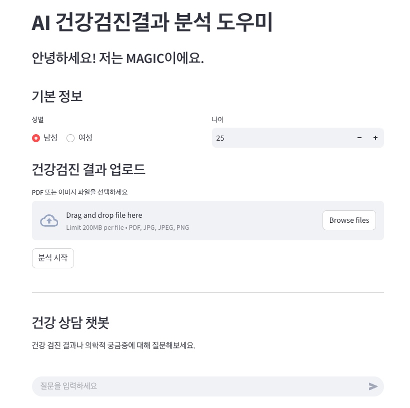

# 🛠️ [AI 건강검진결과 분석 도우미 - MAGIC]

### 📌 Overview
This project was developed as part of the AGI Agent Application Hackathon. It aims to provide friendly explanations and health tips about the user's health checkup results.

### 🚀 Key Features
- ✅ **Information Extraction**: Extract key information from uploaded images using OCR and information extraction technology of Upstage and convert it into JSON format.

  - Key Items:

    - Physical measurements: Height, weight, BMI, waist circumference
    - Blood tests: Blood pressure, hemoglobin, fasting blood sugar, cholesterol, triglycerides, etc.
    - Other test results: Liver function, kidney function, chest X-ray findings, etc.

- ✅ **Providing Health Tips During Loading**: As the process of extracting key information form images takes time, it offers useful health knowledge to the use while waiting for the result.

- ✅ **Friendly Explanation**: Generate user-friendly summary phrases based on the extracted health checkup results using Upstage SOLAR. Avoid complex medical jargon and use everydaty language to provide explanations that also emotionally support the patient.

- ✅ **Hospital/Clinic Recommendations**: Recommend appropriate medical department/specialty based on the user's health checkup results, and also search for hostpitals/clinics nearby the user.

- ✅ **Additional Query System**: When the user asks additional health-related questions (e.g., “How can I manage my hypertension?”), the system provides personalized answers in a chatbot format by referencing the user’s health checkup results and professional health information databases with RAG architecture.

### 🖼️ Demo / Screenshots
https://agi-agent-hackathon.streamlit.app/  
(Available until Apr 5, 2025)

  

### 🧩 Tech Stack
- **Upstage API**
- **LangChain**
- **Streamlit**

### 🏗️ Project Structure
```
📁 AGI_AGENT_HACKATHON_2025-MAGIC/
├── data/
├── sample_data/
├── main.py
├── rag_based_query_system.py
├── UI.py
├── README.md
├── requirements.txt
```

### 🔧 Setup & Installation

```bash
# Clone the repository
git clone https://github.com/UpstageAI/cookbook/usecase/agi-agent-application/AGI_AGENT_HACKATHON_2025-MAGIC.git
cd <repository_directory> # your directory

# Install packages
pip install -r requirements.txt # Python == 3.12

# create .env
echo "API_KEY = '<your Upstage API KEY>'" > .env
echo "GOOGLE_MAPS_API_KEY = '<your Google Maps API KEY>'" >> .env

# run streamlit
streamlit run UI.py
```

### 📁 Dataset & References
- [전국 병의원 및 약국 현황](http://opendata.hira.or.kr/op/opc/selectOpenData.do?sno=11925)
- [일반인을 위한 만성콩팥병 바로알기(3종)](https://www.kdca.go.kr/board/board.es?mid=a20503050000&bid=0021&tag=&act=view&list_no=143371)
- [간질환 바로 알기](https://www.kasl.org/bbs/?number=6028&mode=view&code=general_pamphlet&keyfield=&keyword=&category=&gubun=&orderfield=)
- [한국인 간질환 백서 (개정판): 2023년 업데이트](https://www.kasl.org/bbs/?number=5499&mode=view&code=ency&keyfield=&keyword=&category=&gubun=&orderfield=)
- [나와 가족을 위한 고혈압 예방과 관리 정보](https://www.guideline.or.kr/chronic/view.php?number=88)
- [나와 가족을 위한 당뇨병 예방과 관리 정보](https://www.guideline.or.kr/chronic/view.php?number=89)
- [나와 가족을 위한 이상지질혈증 예방과 관리 정보](https://www.guideline.or.kr/chronic/view.php?number=90)

### 🙌 Team Members

| Name        | Role               | GitHub                             |
|-------------|--------------------|------------------------------------|
| Ji Woo Song     | PM, LLM Pipeline | [@jiuisdisciple](https://github.com/jiuisdisciple) |
| Hanjae Kim  | User Interface, Backend, Code Integration  | [@ONEASH](https://github.com/oneash98) |
| Yeonjae Han  | LLM Pipeline, Prompt Engineering  | [@yeonjaehan](https://github.com/yeonjaehan) |
| Seunghyun Park  | Data Preparation, Prompt Engineering  | [@bluutaco](https://github.com/bluutaco) |

### ⏰ Development Period
- Last updated: 2025-04-04

### 📄 License
This project is licensed under the [MIT license](https://opensource.org/licenses/MIT).  
See the LICENSE file for more details.

### 💬 Additional Notes