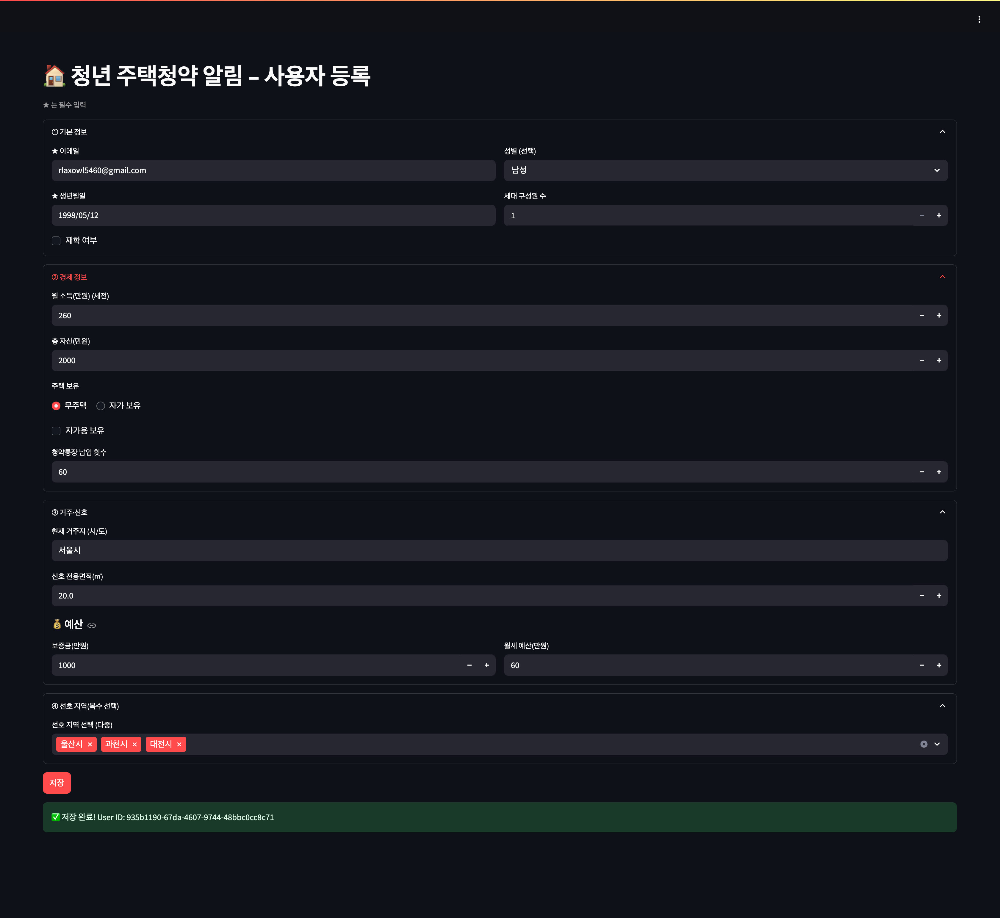
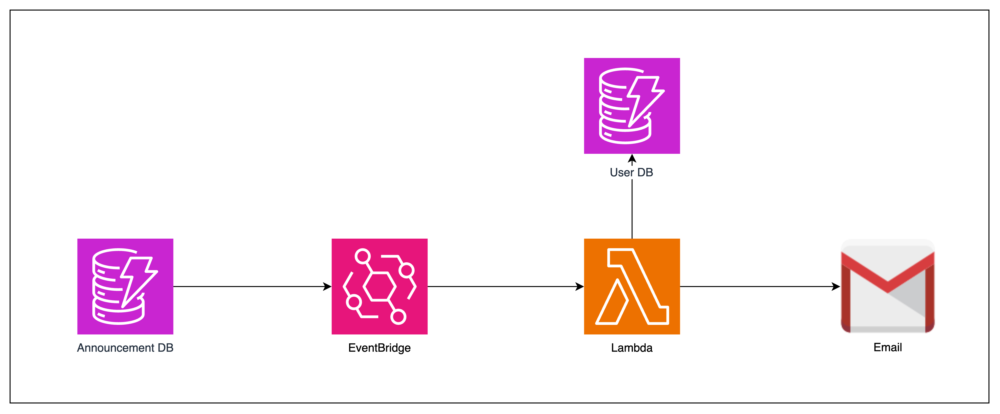
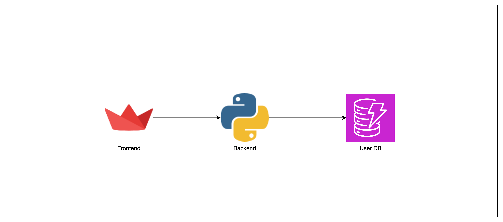
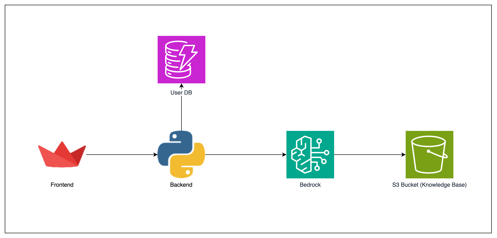

# 🛠️ [HOME SWEET HOME]

### 📌 Overview

This project was developed as part of the Document Based Application Hackathon. It aims to solve the complex and overwhelming process of finding and applying for youth housing by providing targeted notifications and an intelligent Q&A interface using GenAI Bedrock.

### 🚀 Key Features

- ✅ **Smart Notifications**: Receive alerts only for housing applications that match your eligibility criteria.
- ✅ **Automated Workflows**: Seamless integration of crawling, OCR, and information extraction to keep you updated with the latest announcements.
- ✅ **Intelligent Q&A**: Interact with a chatbot powered by GenAI Bedrock for detailed answers about application details such as eligibility and deadlines.

### 🖼️ Demo / Screenshots

#### User Input Demo  



#### Chatting Demo  


#### 🤖 Crawling Diagram  

  

#### 🔔 Notification Diagram  

  

#### ⌨️ User Input Diagram  

  

#### 💬 Chatting  



### 🧩 Tech Stack

- **Frontend**: Streamlit  
- **Backend**: Python (managed via Poetry)  
- **Database**: DynamoDB  
- **Crawling & Automation**: Selenium, AWS EC2 & Lambda  
- **AI Services**: Upstage API and GenAI Bedrock  
- **Others**: SMTP Protocol for email notifications, AWS S3 for storage, AWS EventBridge for monitoring

### 🏗️ Project Structure

```bash
📁 team-bernerslee
├── application
│   ├── application_python_init.sh
│   ├── korea_regions.json
│   ├── poetry.lock
│   ├── pyproject.toml
│   ├── README.md
│   ├── src
│   │   └── housing_alert
│   │       ├── __init__.py
│   │       ├── config.py
│   │       ├── services
│   │       │   ├── __init__.py
│   │       │   ├── ai.py
│   │       │   └── db.py
│   │       └── streamlit_app.py
│   ├── start.sh
│   └── user_data.sh
├── data_collect
│   ├── crawler.py
│   ├── setting.sh
│   ├── Subway.csv
│   ├── 서울시 공공도서관 현황정보.csv
│   ├── 서울시 응급실 위치 정보.csv
│   ├── 서울시 체력단련장업 인허가 정보.csv
│   ├── 서울특별시_하천이용시설 현황_20240906.csv
│   └── 전국초중등학교위치표준데이터.csv
├── images
├── imgs
│   ├── chatting_demo.png
│   ├── chatting.png
│   ├── crawling.png
│   ├── lagacy-main.png
│   ├── lagacy.png
│   ├── notification.png
│   ├── user_input_demo.png
│   └── user_input.png
├── lambda
│   ├── notification
│   │   └── main.py
│   └── pdf_processor
│       └── main.py
├── README.md
└── test
    ├── crawler.py
    ├── data
    │   ├── korea_regions_hierarchical.json
    │   ├── korea_regions.json
    │   ├── parse_regions.py
    │   └── 국토교통부_전국 법정동_20240802.csv
    ├── data2
    │   ├── filtered_cities.json
    │   ├── korea_regions_hierarchical.json
    │   ├── korea_regions.json
    │   ├── normalized_cities.json
    │   ├── parser.py
    │   └── simplified_cities.json
    └── s3_upload_test.sh
```

### 🔧 Setup & Installation

```shell
####################################
## Application Setup (AL2023 - AMD64)
####################################

# Clone the repository
git clone https://github.com/UpstageAI/cookbook/usecase/document-based-application/team-bernerslee.git
cd team-bernerslee/application

# Create the environment configuration file
cat > .env <<'EOF'
AWS_REGION={AWS_REGION}
BEDROCK_REGION={BEDROCK_REGION}
BEDROCK_MODEL_ID={BEDROCK_MODEL_ID}
S3_BUCKET={S3_BUCKET_NAME}
DYNAMO_USER_TABLE={DYNAMODB_USER_TABLE_NAME}
DYNAMO_NOTICE_TABLE={DYNAMO_NOTICE_TABLE}
EOF

# Virtual Environment Setup
curl https://pyenv.run | bash

cat << 'EOF' >> /root/.bashrc

# Pyenv initialization
export PYENV_ROOT="$HOME/.pyenv"
export PATH="$PYENV_ROOT/bin:$PATH"
if command -v pyenv 1>/dev/null 2>&1; then
    # Initialize pyenv
    eval "$(pyenv init --path)"
    eval "$(pyenv init -)"
    # Initialize pyenv-virtualenv
    eval "$(pyenv virtualenv-init -)"
fi
EOF

export PYENV_ROOT="/root/.pyenv"
export PATH="$PYENV_ROOT/bin:$PATH"
eval "$(pyenv init --path)"
eval "$(pyenv init -)"
eval "$(pyenv virtualenv-init -)"

pyenv install -s 3.12.0
pyenv global 3.12.0

python -m pip install --upgrade pip
curl -sSL https://install.python-poetry.org | POETRY_HOME=/usr/local/poetry python -
ln -s /usr/local/poetry/bin/poetry /usr/local/bin/poetry

# Run the Streamlit app
sudo touch /var/log/hackathon_app.log
sudo chmod 666 /var/log/hackathon_app.log

poetry env use "$(pyenv which python)"
poetry install --no-root

export PYTHONPATH=$PWD/src
nohup poetry run streamlit run src/housing_alert/streamlit_app.py \
  --server.port 8501 > /var/log/hackathon_app.log 2>&1 &
```

```shell
####################################
## Crawler Setup (AL2023 - AMD64)
####################################

# Init Setup
sudo yum update -y
sudo yum install -y wget unzip python3-pip

wget https://dl.google.com/linux/direct/google-chrome-stable_current_x86_64.rpm
sudo yum install ./google-chrome-stable_current_x86_64.rpm -y
sudo ln -s /usr/bin/google-chrome-stable /usr/bin/google-chrome

# Chromedriver Setup
wget https://edgedl.me.gvt1.com/edgedl/chrome/chrome-for-testing/135.0.7049.84/linux64/chromedriver-linux64.zip
unzip chromedriver-linux64.zip
sudo mv chromedriver-linux64/chromedriver /usr/bin/chromedriver
chmod +x /usr/bin/chromedriver

pip3 install selenium --user

python -u {PROJECT_DIR}/test/crawler.py
```

### 📁 Dataset & References

- **Dataset used**: Public housing announcement PDFs collected from government websites (e.g., LH, SH) and processed using OCR.
- **References / Resources**:  
  - [Streamlit Documentation](https://docs.streamlit.io/)  
  - [AWS Documentation](https://docs.aws.amazon.com/)  
  - [Upstage API Documentation](https://www.upstage.ai/)

### 🙌 Team Members

| Name        | Role               | GitHub                                             |
|-------------|--------------------|----------------------------------------------------|
| Bohyun Choi | Project Manager    | [@Brilly-Bohyun](https://github.com/Brilly-Bohyun) |
| Woobin Hwang| AI Developer       | [@binhao22](https://github.com/binhao22)           |
| Jiwoo Kim   | Backend Developer  | [@WiseWoo](https://github.com/WiseWoo)             |
| Hoejung Kim | Backend Developer  | [@hjk1996](https://github.com/hjk1996)             |
| Taeji Kim   | Frontend Developer | [@KKamJi98](https://github.com/KKamJi98)           |

### ⏰ Development Period

- Last updated: 2025-04-13

### 📄 License

This project is licensed under the [MIT license](https://opensource.org/licenses/MIT).  
See the LICENSE file for more details.

### 💬 Additional Notes

- Ensure that AWS credentials are properly configured via `~/.aws/credentials` or system environment variables.
- For any issues or further details, please refer to the documentation in the `/docs` directory or contact the development team.
